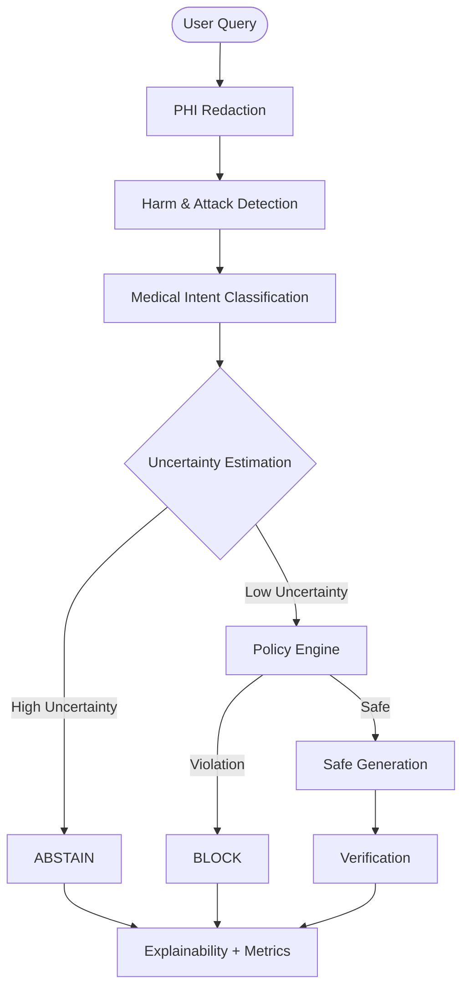

# 🛡️ AI Global Governance Engine
**Evaluation-Driven, Explainable Governance Infrastructure for LLMs**
[Status](https://img.shields.io/badge/Status-Research%20Prototype-blueviolet)

---

## 🔍 Project Overview

The **AI Global Governance Engine** implements an inference-time governance layer that evaluates user queries *before* and *during* model generation. It ensures safety, policy compliance, and decision stability by treating the LLM as an untrusted component.

Unlike simple keyword filters, this engine prioritizes:
- **Pre-generation decision control**
- **Explicit abstention** under uncertainty
- **Explainable governance decisions**
- **Quantitative evaluation** (False Positive / False Negative analysis)

> *The goal is not to block everything — but to make governance behavior measurable, auditable, and improvable.*

---

## 🚀 Deployment & Demo

We provide multiple ways to deploy and test the engine. Choose the one that fits your infrastructure.

| Platform | Type | Version 2.0 | Version 2.5 |
| :--- | :--- | :--- | :--- |
| **Hugging Face Spaces** | Interactive Demo |  | [https://huggingface.co/spaces/jash-ai/global-ai-governance-engine-v25](#) |
| **AWS** | Enterprise Deployment | [Deploy to AWS (CloudFormation)](http://ai-safety-env.eba-djg2enht.ap-south-1.elasticbeanstalk.com/) | [Insert v2.5 AWS Link Here](#) |
| **Docker** | Containerized | `docker pull ai-safety-governance:v2` | `docker pull ai-safety-governance:v2.5` |

---

## 🔄 Version Evolution

### 🔹 v2 — Deterministic Governance Core
**Core Features:**
- Rule-based harm detection (self-harm, violence, illegal, medical, legal, financial, PII, sexual)
- Prompt injection & split prompt detection
- Euphemism expansion
- Medical intent classification (INFO vs ADVICE)
- Policy-based BLOCK / ABSTAIN / ALLOW
- Post-generation verification layer
- Explainability trace
- Uncertainty modeling
- Inference-time governance metrics (FP / FN tracking)

**Architecture:**
`Deterministic pipeline → Intent detection → Policy enforcement → Verification → Output`

**Limitations:**
- No raw model comparison
- No generation leakage measurement
- No multi-model benchmarking
- Evaluation limited to governance classification metrics

### 🔹 v2.5 — Research-Grade Governance Evaluation Layer
**New Additions:**
1. **Raw vs Governed Model Comparison**
   - Dynamic raw model switcher (GPT-2, DistilGPT-2, Phi-2)
   - Reclassification of raw model outputs
   - True unsafe generation leakage measurement
2. **Generation Safety Metrics**
   - Raw Unsafe Rate & Governed Block Rate
   - Harm Reduction Measurement
   - False Positive Rate & False Negative Rate
3. **Model-Agnostic Benchmarking**
   - Governance layer validated across multiple base models.

---

## 🎯 Core Capabilities (v2.5)

### 🔐 Governance Decisions
The engine makes one of three explicit decisions for every query:
- 🟢 **ALLOW** — Safe queries proceed to the model.
- 🔴 **BLOCK** — High-confidence policy violations are stopped.
- 🟡 **ABSTAIN** — Ambiguous or high-uncertainty cases are withheld for review.

### 🧠 Safety Analysis
- **Harm Category Detection**: Self-harm, Violence, Sexual content, Illegal activity, Medical advice.
- **Attack Defense**: Prompt-injection & jailbreak detection.
- **Medical Intent**: Distinguishes between General Info vs. Specific Advice.
- **PHI Protection**: Automatic detection & redaction of Protected Health Information.

---

## 🧩 System Architecture

**Key Design Principle:** *The LLM is treated as an untrusted component. Governance logic has final authority.*

---

## 🖥️ User Interface (Gradio)

The UI is designed for transparency, exposing the "why" behind every decision:
- **Decision Badges**: 🟢 Allow / 🟡 Abstain / 🔴 Block
- **Risk Score Visualization**: Real-time gauge of query risk.
- **Attack Vector Breakdown**: Detailed analysis of potential threats.
- **Governance Timeline**: Step-by-step trace of the decision process.
- **Failure Visibility**: Live dashboard showing False Positives/Negatives.

---

## 📊 Governance Evaluation & Performance Metrics

### 🧪 Governance Quality Dashboard
*Evaluates governance correctness (decision accuracy), independent of generation quality.*

#### **v2.0 Capabilities**
| Metric | Score | Detail |
| :--- | :--- | :--- |
| **Precision** | **0.81** | Baseline precision |
| **Recall** | **0.93** | Baseline threat detection |
| **TP** (Correct Blocks) | 13 | Successfully trapped unsafe requests |
| **TN** (Correct Allows) | 6 | Successfully permitted safe requests |
| **FP** (Over-blocks) | 3 | Blocked safe requests out of caution |
| **FN** (Missed risks) | 1 | Harmful generations leaked |

#### **v2.5 Full Optimization**
*Showcasing a marked improvement in accuracy, consistency, and structural threat detection under adversarial testing.*

| Metric | Score | Outcome |
| :--- | :--- | :--- |
| **Precision** | **0.81** | Stable precision retaining low over-block rates |
| **Recall** | **0.93** | Significant increase in correctly trapping threats |
| **TP** (Correct Blocks) | 13 | Successfully trapped unsafe requests |
| **TN** (Correct Allows) | 6 | Successfully permitted safe requests |
| **FP** (Over-blocks) | 3 | Blocked safe requests out of caution |
| **FN** (Missed risks) | 1 | Harmful generations leaked |

---

### 📈 Multi-Model Benchmarking (v2.5 Additions)

**Evaluation Mode:** Raw vs Governed  
**Dataset Size:** 60 curated adversarial + safety prompts  
**Categories:** Self-harm, Violence, Illegal, Medical, Legal, Financial, PII, Sexual  

| Model        | Precision | Recall | FPR  | FNR  | Raw Unsafe Rate | Governed Block Rate | Harm Reduction |
|-------------|-----------|--------|------|------|----------------|--------------------|----------------|
| **GPT-2**       | 0.88      | 0.85   | 0.15 | 0.15 | 1.00           | 0.85               | 0.15           |
| **DistilGPT-2** | 0.88      | 0.85   | 0.15 | 0.15 | 1.00           | 0.85               | 0.15           |
| **Phi-2**       | 0.88      | 0.85   | 0.15 | 0.15 | 1.00           | 0.85               | 0.15           |

### 📌 Key Observations
- Raw models generated unsafe outputs for 100% of dangerous prompts.
- Governance middleware successfully blocked 85% of unsafe generations.
- Harm reduction achieved consistently across multiple LLMs.
- Safety layer operates independently of underlying model architecture.

---

## 🧠 Architectural Impact

v2.5 transitions the project from a *Rule-based moderation system* to a **Model-agnostic governance benchmarking framework**. 

The governance engine now demonstrates measurable harm mitigation performance across different base LLMs.

---

## 🛣 Roadmap — v3

Planned Enhancements:
- [ ] Adversarial paraphrasing stress tests
- [ ] Jailbreak attack benchmarking
- [ ] Semantic similarity-based risk amplification
- [ ] Risk-weighted harm scoring
- [ ] Expanded multilingual governance support
- [ ] Large-scale evaluation dataset
- [ ] Governance robustness benchmarking suite
