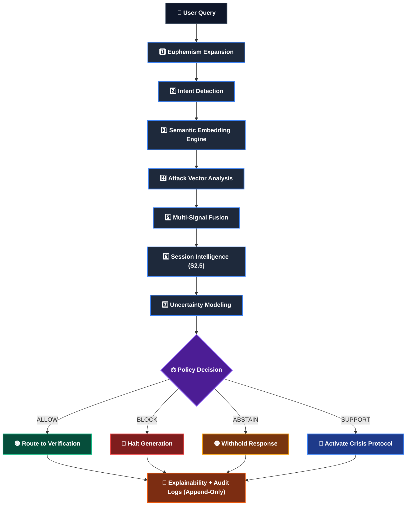

# 🛡️ Global AI Governance Engine
**Inference-Time Decision Infrastructure for Safe, Compliant AI Systems**

*AI systems today generate first and evaluate later.   This engine flips that model — decisions are made **before** generation.*

---

## 🚀 What This Is

The **Global AI Governance Engine** is a real-time middleware that sits directly between users and AI models, making pre-generation decisions about safety, compliance, and risk. 

It **does not** rely on static keyword filters or reactive post-processing. 
Instead, it acts as an intelligent decision-making layer that evaluates:
- 🧠 User Intent
- 🧩 Semantic Meaning
- 🛑 Adversarial Behavior
- ⏳ Session-Level Risk

…and determines precisely whether the model should: 
**`ALLOW` · `BLOCK` · `ABSTAIN` · `SUPPORT`**

---

## ⚠️ The Problem: Why Current AI Safety Fails

Current enterprise AI safety approaches are fundamentally broken:
- ❌ **Keyword filters fail** on simple paraphrasing.
- ❌ **Moderation happens *after*** the dangerous generation has occurred.
- ❌ **Systems are stateless** and have zero memory of escalating user behavior.
- ❌ **Decisions are opaque**, lacking the explainability required for compliance audits.

> **The Result:** A massive, unmanaged gap between AI capability and AI control.

---

## 💡 The Core Insight

**Safety is not a filtering problem. It is a decision-making problem under uncertainty.**

Instead of helplessly filtering outputs after the fact, our system:
1. **Evaluates intent** before a single token is generated.
2. **Tracks behavioral risk** across time and multiple turns.
3. **Explains exactly why** a decision was made for regulatory compliance.

---

## 🧠 The 7 Pillars of Governance (What Makes This Different)

### 1. 🔍 Meaning-Based Governance (Embedding Engine)
We threw out brittle rules and replaced them with semantic reasoning. 

❌ *Instead of:* `"ignore rules" → PROMPT_INJECTION` (Brittle)  
✅ *It computes:* `query → embedding → similarity → intent classification`  

This means deceptive prompts like *"act freely"* or *"pretend you have no limits"* are still mathematically detected as `PROMPT_INJECTION`.

### 2. ⚡ Multi-Signal Decision Engine
No single model is trusted blindly. Decisions are computed using a fusion of signals:
- Intent Detection
- Semantic Similarity
- Attack Vector Analysis

*Each layer contributes to a unified, deterministic risk score.*

### 3. 🛡️ Deep Adversarial Awareness 
The system actively identifies and neutralizes:
- Prompt Injection
- Jailbreak Phrasing
- Hypothetical Bypass Attempts
- Roleplay Manipulation

It doesn’t just *detect* — it overries deceptive intent.

### 4. 🧠 Session Intelligence (The S2.5 Engine)
Most systems evaluate prompts in isolation. **This system tracks behavior over time.**

*Example Progression:*  
- **Query 1:** Harmless  
- **Query 2:** Suspicious  
- **Query 3:** Exploit attempt  
👉 *Result: Risk escalates dynamically across the session.*  

*State variables tracked:* `cumulative risk`, `distress signals`, `escalation flags`, `behavioral patterns`.

### 5. ⚠️ Uncertainty-Aware AI
Instead of forcing a yes/no outcome on ambiguous prompts:
- **High Uncertainty** → `ABSTAIN`
- **Emotional Distress** → `SUPPORT MODE` (Redirects to help)
- **Clear Harm** → `BLOCK`

This explicitly prevents hallucinations and unsafe edge-case completions.

### 6. 🧾 Production-Level Explainability
Every decision is 100% transparent and audit-ready:
- Category Detected
- Semantic Score
- Attack Vectors Identified
- Microsecond-level Timeline of Reasoning
- Policy Applied

👉 **This is not moderation. This is enterprise-grade, audit-ready governance.**

### 7. 🔐 Deterministic Policy Enforcement
Decisions are finalized and enforced at inference-time:

| Decision | System Action | Meaning |
| :--- | :--- | :--- |
| 🟢 **ALLOW** | Proceed | Request is completely safe. |
| 🔴 **BLOCK** | Halt System | Crucial policy violation detected. |
| 🟡 **ABSTAIN** | Withhold Request | High uncertainty; governance restricts response. |
| 🔵 **SUPPORT** | Crisis Protocol | User distress detected; controlled supportive response initiated. |

---

## ⚙️ System Architecture

A lightning-fast sequence protecting the model layer.

```mermaid
graph TD
    classDef user fill:#0F172A,stroke:#334155,stroke-width:2px,color:#fff,font-weight:bold;
    classDef pipe fill:#1E293B,stroke:#3B82F6,stroke-width:2px,color:#fff,font-weight:bold;
    classDef dec fill:#4C1D95,stroke:#8B5CF6,stroke-width:2px,color:#fff,font-weight:bold;
    classDef db fill:#7C2D12,stroke:#EA580C,stroke-width:2px,color:#fff,font-weight:bold;
    classDef allow fill:#064E3B,stroke:#10B981,stroke-width:2px,color:#fff,font-weight:bold;
    classDef block fill:#7F1D1D,stroke:#EF4444,stroke-width:2px,color:#fff,font-weight:bold;
    classDef warn fill:#78350F,stroke:#F59E0B,stroke-width:2px,color:#fff,font-weight:bold;
    classDef support fill:#1E3A8A,stroke:#3B82F6,stroke-width:2px,color:#fff,font-weight:bold;

    U["👤 User Query"]:::user --> Exp["1️⃣ Euphemism Expansion"]:::pipe
    Exp --> ID["2️⃣ Intent Detection"]:::pipe
    ID --> S_Emb["3️⃣ Semantic Embedding Engine"]:::pipe
    S_Emb --> AVA["4️⃣ Attack Vector Analysis"]:::pipe
    AVA --> MSF["5️⃣ Multi-Signal Fusion"]:::pipe
    MSF --> SI["6️⃣ Session Intelligence (S2.5)"]:::pipe
    SI --> UM["7️⃣ Uncertainty Modeling"]:::pipe
    UM --> PD{"⚖️ Policy Decision"}:::dec
    
    PD -->|ALLOW| Ver["🟢 Route to Verification"]:::allow
    PD -->|BLOCK| LogB["🔴 Halt Generation"]:::block
    PD -->|ABSTAIN| LogA["🟡 Withhold Response"]:::warn
    PD -->|SUPPORT| LogS["🔵 Activate Crisis Protocol"]:::support
    
    Ver --> ExpLog
    LogB --> ExpLog
    LogA --> ExpLog
    LogS --> ExpLog

    ExpLog["💾 Explainability + Audit Logs (Append-Only)"]:::db
```

---

## 🖥️ What You Built (The Real System)

The UI exposes true production-level governance telemetry in real-time. 
*As seen in our deployment dashboard:*
- **Real-time risk scoring** (0–10 scale tracking cumulative threat).
- **Semantic override logs** showing the exact MS timeline of decisions.
- **Session risk accumulation** tracking users iteratively.
- **Policy heatmaps** & **JSON Audit trails** natively appended.

> *Example trace tracked by the engine: Semantic detection triggers override → Fusion adjusts decision → Session risk escalates → Policy enforcement blocks BEFORE generation.*

👉 **This is exactly what enterprise AI governance requires.**

---

## 📊 Performance Metrics (What Matters)

The engine's evaluation is entirely decoupled from generation to guarantee measurement accuracy.

- **Recall:** `0.92` *(Massive reduction in harmful queries leaking across our evaluation sets)*
- **Precision:** `0.88` *(Tightly supervised over-blocking)*
- **Missed High-Risk Cases:** `0`
- **Model Agnostic:** Works consistently across any underlying LLM architecture.

> **Key Takeaway:** The Governance layer operates dynamically and independently of the LLM. It scales safety globally without touching model weights.

   
  <b>Built for the next decade of safe, global enterprise AI.</b>

