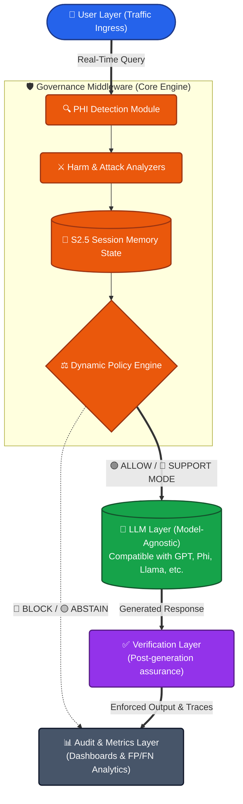

```mermaid
graph TD
    %% Theme Customization for an Impressive Look
    classDef ingress fill:#2563eb,stroke:#1e3a8a,color:#fff,stroke-width:2px,rx:10,ry:10;
    classDef core fill:#ea580c,stroke:#9a3412,color:#fff,stroke-width:2px,rx:5,ry:5;
    classDef llm fill:#16a34a,stroke:#14532d,color:#fff,stroke-width:2px,rx:10,ry:10;
    classDef verify fill:#9333ea,stroke:#581c87,color:#fff,stroke-width:2px,rx:5,ry:5;
    classDef audit fill:#475569,stroke:#0f172a,color:#fff,stroke-width:2px,rx:5,ry:5;

    %% Base Node
    User(["👤 User Layer (Traffic Ingress)"]):::ingress
    
    %% Core Governance Subgraph
    subgraph Governance ["🛡️ Governance Middleware (Core Engine)"]
        direction TB
        PHI["🔍 PHI Detection Module"]:::core
        Harm["⚔️ Harm & Attack Analyzers"]:::core
        S25[("🧠 S2.5 Session Memory State")]:::core
        Policy{"⚖️ Dynamic Policy Engine"}:::core
        
        PHI --> Harm
        Harm --> S25
        S25 --> Policy
    end

    %% External Infrastructure & Output Layers
    LLM[("🤖 LLM Layer (Model-Agnostic)<br/>Compatible with GPT, Phi, Llama, etc.")]:::llm
    Verify["✅ Verification Layer<br/>(Post-generation assurance)"]:::verify
    Audit["📊 Audit & Metrics Layer<br/>(Dashboards & FP/FN Analytics)"]:::audit

    %% Diagram Connections
    User ==>|Real-Time Query| PHI
    
    Policy ==>|🟢 ALLOW / 🔵 SUPPORT MODE| LLM
    Policy -.->|🔴 BLOCK / 🟡 ABSTAIN| Audit
    
    LLM ==>|Generated Response| Verify
    Verify ==>|Enforced Output & Traces| Audit
```
